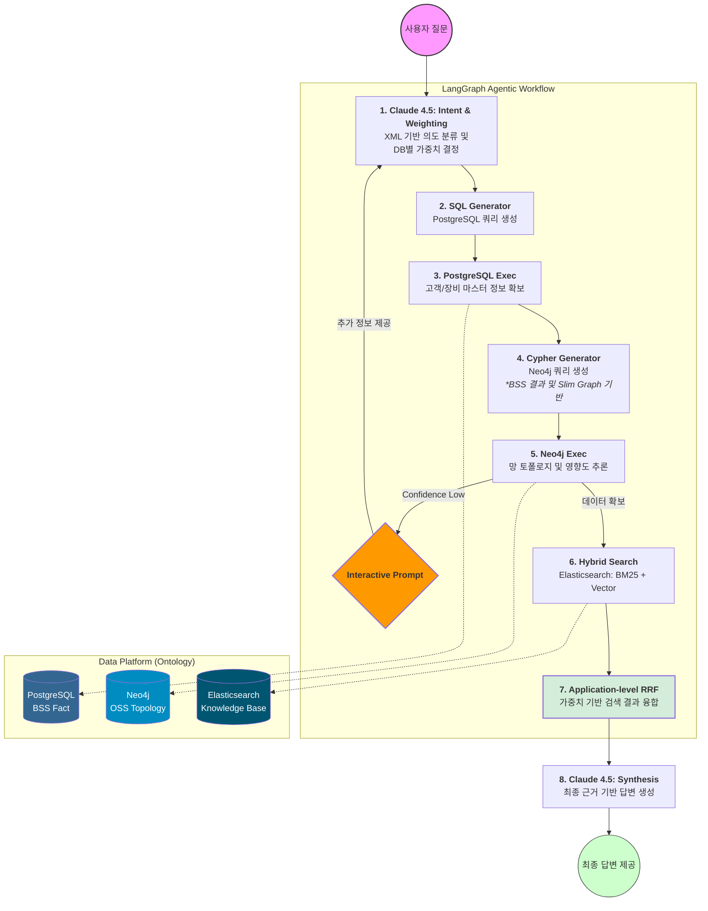
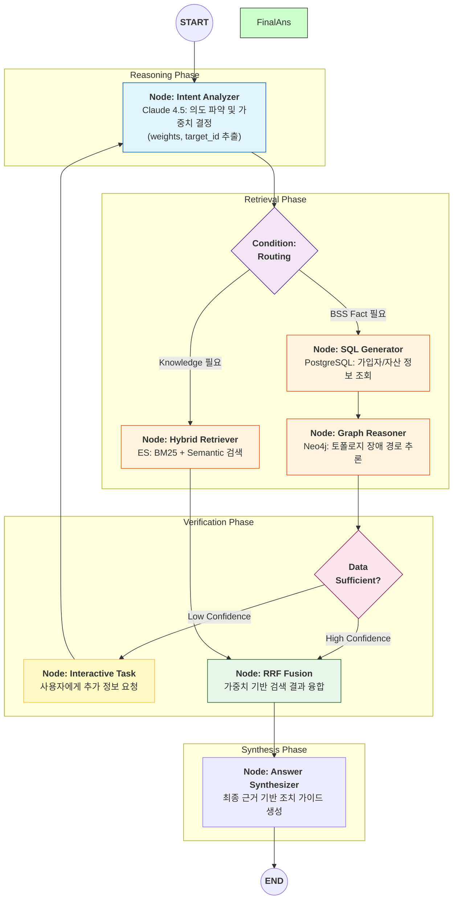

# 📡 hybrid-rag-telco-ops

**Autonomous Deep Agent Framework for Intelligent Telco Operations.**

`hybrid-rag-telco-ops`는 **LangGraph**를 오케스트레이터로, **LangChain**을 도구 생태계로 활용하는 **Deep Agent** 기반 프로젝트입니다.

본 프로젝트는 파편화된 통신 데이터(BSS/OSS)를 단일 지능형 온톨로지로 통합하여, 장애 발생 시 **"가입자 영향도 파악 → 망 토폴로지 분석 → 기술 매뉴얼 기반 조치 가이드 생성"** 을 단일 사고 루프로 처리하는 **자율형 AI Ops 시스템** 구축을 목표로 합니다.

---

## 🎯 시스템 구축 목표 (System Vision)

본 시스템은 제한된 로컬 리소스(Windows 11, 16GB RAM) 환경에서도 대규모 통신 인프라를 관제할 수 있는 **'초경량·고추론'** 모델을 지향하며, 다음과 같은 핵심 시스템 가치를 구현합니다.

### **1. 데이터 사일로 해소 (Data Synergy)**

* **Cross-Domain Reasoning:** 서로 다른 DB에 존재하는 가입자 정보(SQL)와 물리적 망 연결 구조(Graph)를 에이전트가 실시간으로 교차 참조하여, 특정 장비 장애가 어떤 VIP 고객에게 영향을 주는지 즉각 추론합니다.

### **2. 자율적 의사결정 (Autonomous Planning)**

* **Goal-Oriented Agent:** 사용자의 막연한 질문을 접수하면 에이전트가 스스로 실행 계획을 수립하고 수행합니다.

### **3. 지능형 검색 및 분석 (Advanced Retrieval)**

* **Hybrid Knowledge Engine:** 오픈소스 **BGE-M3**를 활용하여 통신 전문 용어에 특화된 **Dense + Sparse** 하이브리드 검색 시스템을 구축합니다.

### **4. 로컬 하드웨어 최적화 (Hyper-Optimization)**

* **Resource-Aware Intelligence:** **ONNX Runtime 가속**을 통해 GPU 없이 i7 CPU의 연산 성능을 극한으로 끌어올려 실시간 응답성을 확보합니다.

---

## 🏗 Deep Agent 아키텍처 (Detailed Architecture)

본 아키텍처는 **"심층 추론(Deep Reasoning)"** 과 **"자원 최적화(Resource Efficiency)"** 를 동시에 달성하기 위해 설계되었습니다.

### **1. Core Intelligence Layer: 지능형 제어 계층**

* **Orchestrator (LangGraph: State Machine)**
* **역할:** 에이전트의 사고 흐름을 DAG(Directed Acyclic Graph) 형태의 상태 머신으로 관리합니다.
* **기능:** 추론의 각 단계에서 상태(State)를 보존하며, 조건부 분기(Conditional Edge)를 통해 특정 조건 충족 시 이전 단계로 회귀하거나 다음 단계로 전이합니다.
* **상태 정의:** 태스크 리스트, 중간 결과(Context), 쿼리 실패 이력, 응답 후보 등을 관리합니다.


* **Brain (Claude 4.5: Planning & Verification)**
* **역할:** 고차원 추론을 통해 복잡한 과업을 하위 목표(Sub-goals)로 분해하는 전략가 역할을 수행합니다.
* **Planning Tool:** 질문 분석 후 필요한 정보의 종류(BSS/OSS/KB)와 접근 순서를 결정합니다.
* **Verification:** 실행 결과가 답변하기 충분한지, 할루시네이션은 없는지 논리적으로 검증합니다.


* **Library (LangChain: Semantic Interfacing)**
* **역할:** 이기종 데이터베이스와 LLM 사이의 통역사 역할을 수행합니다.
* **인터페이스 엔진:** PostgreSQL(SQL), Neo4j(Cypher), Elasticsearch(Vector Query)를 위한 정형화된 프로토콜을 제공합니다.


### **2. Deep Agent 핵심 메커니즘: 자율 운영 엔진**

* **Hybrid Result Fusion (애플리케이션 계층 검색 융합)**
* **역할:** Elasticsearch 무료 라이선스 제약을 극복하고 BGE-M3 하이브리드 검색 성능 극대화.
* **기능:** Semantic(의미)과 BM25(키워드) 결과를 독립적으로 수집 후, Python 기반 RRF(Reciprocal Rank Fusion) 함수로 재정렬.
* **효과:** 고가의 Enterprise 기능 없이도 최상위 수준의 검색 품질 구현.


* **Self-Correction Loop (자율 교정 루프)**
* **Query Self-Healing:** 생성한 쿼리(SQL/Cypher) 실행 오류 시, 에러 메시지를 분석하여 문법을 스스로 수정하고 재실행합니다.
* **Recursive Retrieval:** 검색 결과의 유사도가 낮을 경우 검색어 확장(Query Expansion)을 통해 만족스러운 결과가 나올 때까지 반복 탐색합니다.


* **Filesystem Context Management (오프-메모리 컨텍스트 관리)**
* **역할:** 16GB RAM 환경에서 발생하는 메모리 부족(OOM) 문제를 해결합니다.
* **기능:** LangGraph의 `Checkpointer`를 활용하여 추론 중간 상태를 로컬 파일시스템(SQLite 등)에 기록하여 메모리 점유를 최소화합니다.

---

## 🧠 심층 추론 전략 (Deep Reasoning Strategy)

### **1. Claude 4.5 전용 'Intent & Weighting' 프롬프트**

Planner 노드는 질문의 성격에 따라 데이터 소스별 가중치를 동적으로 할당합니다.

```xml
<system_instruction>
당신은 통신사 장애 대응 시스템의 오케스트레이터입니다. 질문을 분석하여 3가지 소스에 대한 가중치(합 1.0)를 결정하세요.
1. PostgreSQL(BSS): 고객 팩트 체크 / 2. Neo4j(OSS): 망 토폴로지 추론 / 3. Elasticsearch(Knowledge): 조치 매뉴얼
</system_instruction>
<intent_rules>
- 특정 고객/전화번호 포함 시 -> PG 가중치 UP
- '원인/영향도' 분석 요청 시 -> Neo4j 가중치 UP
- '조치 방법/매뉴얼' 요청 시 -> ES 가중치 UP
</intent_rules>

```

* **시나리오 A (VIP 장애 원인):** `{"pg": 0.4, "neo4j": 0.5, "es": 0.1}`
* **시나리오 B (표준 조치 절차):** `{"pg": 0.1, "neo4j": 0.3, "es": 0.6}`

### **2. AT&T식 객체 중심 온톨로지 및 Slim Graph**

AT&T와 팔란티어 AIP의 철학을 반영하여 **"Noun(Graph) vs Adjective(SQL)"** 원칙으로 설계합니다.

* **Neo4j (Slim Graph):** 추론의 길목이 되는 핵심 관계(Status, Hierarchy)만 노드로 구성하여 메모리 효율과 추론 속도 극대화.
* **PostgreSQL (Rich Metadata):** 시리얼 번호, 제조사 상세 스펙 등 단순 정보는 **Lazy Loading** 방식으로 필요할 때만 SQL 툴로 호출.
* **ID-Mapping Ledger:** 모든 DB가 공통된 `Asset_ID`를 공유하여 즉각적인 Cross-DB Join 방지 및 애플리케이션 레벨 결합.

### **3. 지능형 네비게이터로서의 Elasticsearch**

ES는 단순 부가 정보 저장소가 아닌 전체 시스템의 **Entry Point** 역할을 수행합니다.

* **BM25:** 오타가 섞인 장비 일련번호나 모델명을 정확히 포착해 그래프 탐색의 시작점(Node)을 제공.
* **Semantic Search:** 비정형 상담 로그 및 십수 년치 기술 매뉴얼에서 경험적 지식(Solution) 추출.


---

## 🛠 데이터 전략 (Data Orchestration)

| 데이터 소스 | 역할 | 특징 |
| --- | --- | --- |
| **PostgreSQL** | **Fact & Metadata** | 고객 가입 정보, 장비 상세 사양 등 정형 데이터 |
| **Neo4j** | **Slim Ontology** | 상태, 위치, 유형 중심의 가벼운 그래프 노드로 연결성 추론 |
| **Elasticsearch** | **Knowledge Base** | **BGE-M3** 기반 하이브리드 검색 (Dense + Sparse) |

### **1. Elasticsearch (할당: 4GB)**

* **JVM 최적화:** `ES_JAVA_OPTS="-Xms2g -Xmx2g"` 고정으로 메모리 파편화 방지.
* **Hybrid Search:** BGE-M3 기반의 고정밀 시맨틱 검색 구현.

### **2. Neo4j (할당: 2GB)**

* **Slim Ontology:** 추론에 필수적인 핵심 관계(Hierarchy) 위주로 노드를 경량화하여 메모리 효율 극대화.

### **3. PostgreSQL (할당: 1GB)**

* **Fact Ledger:** 가입자 및 장비 메타데이터의 최종 신뢰 소스(Source of Truth) 역할.

---

## 🔍 기술 검토 및 최적화 전략 (Technical Review & Strategy)

본 프로젝트는 Windows 11 노트북의 제한된 자원을 활용하면서도 엔터프라이즈급 추론 성능을 확보하기 위해 다음과 같은 기술적 의사결정을 내렸습니다.

### **1. Vector Engine 선택: Elasticsearch vs PGVECTOR**

데이터 관리의 단순성보다 **검색 정밀도와 자원 격리**를 최우선으로 고려하였습니다.

* **BGE-M3 하이브리드 최적화:** BGE-M3의 핵심인 Dense + Sparse 검색을 극대화하기 위해, Application-level RRF 로직을 구현합니다. 이는 ES 무료 라이선스 제약을 극복하며 하이브리드 검색의 장점을 온전히 취하기 위함입니다.
* **리소스 격리:** 16GB RAM 환경에서 벡터 연산이 PostgreSQL의 성능을 잠식하지 않도록 독립적인 프로세스로 관리합니다.

### **2. 임베딩 및 추론 가속: CPU-only Optimization**

로컬 GPU 부재를 극복하기 위해 하드웨어 가속 기술을 전방위적으로 적용합니다.

* **ONNX Runtime:** 모델을 C++ 수준으로 직렬화하여 Python 인터프리터 오버헤드를 제거합니다.
* **Intel i7-1360P 최적화:** `fastembed` 라이브러리를 통해 AVX-512 및 VNNI 명령어셋을 활용, 임베딩 지연 시간을 실시간 수준으로 단축합니다.

### **3. 지식 저장소 분리 전략 (3-Tier Storage)**

데이터 성격에 최적화된 엔진을 명확히 구분하여 추론 속도를 높입니다.

* **PostgreSQL (Fact):** 가입자/계약/인벤토리 메타데이터 관리.
* **Neo4j (Topology):** 장비 간 계층 구조 및 토폴로지 맵(Slim Ontology).
* **Elasticsearch (Knowledge):** 비정형 매뉴얼(SOP) 및 시맨틱 벡터 지식 베이스.

### **4. 데이터 일관성 및 동기화 (Sync Strategy)**

이기종 DB 간의 데이터 불일치를 방지하기 위한 전략입니다.

* **ID-Mapping Ledger:** 모든 DB가 공통된 `Asset_ID`를 공유하여, SQL 결과를 기반으로 즉시 Graph/Vector 검색으로 전환할 수 있는 인덱싱 구조를 확립합니다.
* **Event-Driven Update:** Postgres 메타데이터 변경 시, Neo4j 및 ES에 상태값이 반영되도록 경량 동기화 파이프라인을 구축합니다.


### **5. Vector Engine 운영 전략: 하이브리드 검색 고도화**

무료 라이선스의 제약을 기술적으로 극복하고 고성능 검색 품질을 확보하기 위한 전략입니다.

* **라이선스 극복:** 내장 RRF 미지원 문제를 애플리케이션 계층(Python)에서 RRF 로직을 직접 구현하여 해결합니다.
* **검색 품질 보장:** Dense/Sparse 결과값을 결합할 때 가중치(K값)를 통신 도메인에 최적화하여 상용 수준의 정확도를 확보합니다.

---

## 📊 기대 효과 (Expected Outcomes)

* **MTTR 혁신:** 장애 원인 파악 시간을 AI의 자율 추론으로 획기적 단축.
* **Operational Autonomy:** 인프라 운영자의 개입을 최소화하는 자율형 관제 어시스턴트.
* **Hardware Efficiency:** 일반 노트북에서 구동 가능한 고성능 AI Ops 모델 실현.

---

## 🚀 적용 분야 (Application Areas)

* **지능형 네트워크 관제 (Intelligent NOC):** 근본 원인(Root Cause) 분석 및 중복 알람 필터링.
* **고객 경험 기반 기술 상담:** VOC 접수 시 가입자망 경로 및 상태 요약 제공.
* **현장 출동 가이드 자동화:** 위치 정보 및 과거 장애 조치 매뉴얼(SOP) 통합 제공.
* **인프라 자원 최적화:** 장비 수명 주기 및 장애 패턴 분석을 통한 예방 정비 지원.

---

## 🗺 구축 로드맵 (Implementation Roadmap)

### **Phase 1: Foundation & Resource Setup**

* [ ] **Repository Setup:** 프로젝트 비전 및 Deep Agent 아키텍처 정의.
* [ ] **Docker Orchestration:** Windows 환경 최적화 자원 할당 및 컨테이너망 구성.
* [ ] **BGE-M3 Acceleration:** FastEmbed/ONNX 기반 CPU 가속 임베딩 엔진 구현.

### **Phase 2: Deep Agent Orchestration**

* [ ] **Planner Node:** Claude 4.5용 통신 도메인 특화 Planning 프롬프트 설계.
* [ ] **Agentic RAG:** 검색 결과 부족 시 스스로 쿼리를 수정하는 Iterative Retrieval 구현.
* [ ] **State Machine:** 추론 경로를 관리하는 LangGraph 워크플로우 개발.

### **Phase 3: Integration & Reliability**

* [ ] **Self-Correction Tuning:** 쿼리 실패 시나리오에 대한 자기 수정 능력 강화.
* [ ] **Scenario Test:** 실제 통신 장애 로그 기반 엔드투엔드 RCA 테스트 및 성능 측정.

---
## 별첨

**hybrid-rag-telco-ops: docker-compose.yml** (샘플)

```yaml
version: '3.8'

services:
  # 1. PostgreSQL: Fact & Metadata (할당 1GB)
  postgres:
    image: postgres:15-alpine
    container_name: telco-postgres
    environment:
      POSTGRES_USER: admin
      POSTGRES_PASSWORD: password123
      POSTGRES_DB: telco_db
    ports:
      - "5432:5432"
    volumes:
      - ./data/postgres:/var/lib/postgresql/data
    deploy:
      resources:
        limits:
          memory: 1G
    healthcheck:
      test: ["CMD-SHELL", "pg_isready -U admin -d telco_db"]
      interval: 10s
      timeout: 5s
      retries: 5

  # 2. Neo4j: Slim Ontology (할당 2GB)
  neo4j:
    image: neo4j:5.12-community
    container_name: telco-neo4j
    ports:
      - "7474:7474" # HTTP
      - "7687:7687" # Bolt
    environment:
      - NEO4J_AUTH=neo4j/password123
      - NEO4J_dbms_memory_pagecache_size=1G
      - NEO4J_dbms_memory_heap_initial_size=512M
      - NEO4J_dbms_memory_heap_max_size=1G
    volumes:
      - ./data/neo4j/data:/data
      - ./data/neo4j/logs:/logs
    deploy:
      resources:
        limits:
          memory: 2G

  # 3. Elasticsearch: Knowledge Base (할당 4GB)
  elasticsearch:
    image: docker.elastic.co/elasticsearch/elasticsearch:8.10.2
    container_name: telco-elasticsearch
    environment:
      - discovery.type=single-node
      - xpack.security.enabled=false # 로컬 테스트용 보안 비활성화
      - "ES_JAVA_OPTS=-Xms2g -Xmx2g" # JVM 힙 메모리 고정 (4GB 중 2GB 사용)
    ports:
      - "9200:9200"
    volumes:
      - ./data/elasticsearch:/usr/share/elasticsearch/data
    deploy:
      resources:
        limits:
          memory: 4G
    healthcheck:
      test: ["CMD", "curl", "-f", "http://localhost:9200/_cluster/health"]
      interval: 30s
      timeout: 10s
      retries: 5

networks:
  default:
    name: telco-network

```

---
## [별첨] 팔란티어식 하이브리드 Graph RAG 전체 아키텍처



---

## [별첨] LangGraph Agentic Workflow



---

## 📖 별첨: 용어 사전 (Glossary)

통신 도메인 지식(BSS/OSS)과 최신 AI 기술(RAG, Agent)이 결합된 프로젝트인 만큼, 별첨으로 포함하면 협업자나 Claude Code가 맥락을 파악하는 데 큰 도움이 됩니다.

| 구분 | 용어 | 정의 및 본 프로젝트에서의 역할 |
| --- | --- | --- |
| **Domain** | **BSS (Business Support System)** | 고객 관리, 요금 청구 등 사업 지원 시스템. 본 프로젝트의 **PostgreSQL**에 해당하며 '가입자 팩트'의 원천입니다. |
| **Domain** | **OSS (Operations Support System)** | 망 구성, 장비 상태 관제 등 운영 지원 시스템. **Neo4j**의 토폴로지 데이터와 **ES**의 기술 매뉴얼이 이 영역에 속합니다. |
| **Agent** | **Intent Classification** | 사용자의 질문 목적을 분류하는 것. Claude 4.5가 XML 프롬프트를 통해 DB별 가중치를 결정하는 핵심 단계입니다. |
| **Agent** | **Self-Healing Query** | 에이전트가 생성한 SQL/Cypher 쿼리가 실패했을 때, 에러 로그를 분석하여 스스로 문법을 수정하고 재실행하는 메커니즘입니다. |
| **Agent** | **Confidence Threshold** | 추론 결과의 확신도 임계값. 이 값보다 낮으면 독단적으로 답하지 않고 사용자에게 추가 정보를 요청(Interactive Reasoning)합니다. |
| **Data** | **Slim Ontology** | 추론에 꼭 필요한 핵심 관계(Noun)만 그래프에 담고, 상세 속성(Adjective)은 정형 DB로 분리하여 효율을 높인 설계 방식입니다. |
| **Data** | **Golden ID (Asset_ID)** | 이기종 DB(PG, Neo4j, ES) 간에 데이터를 매핑하기 위한 유일한 식별자. Cross-DB 추론의 연결고리 역할을 합니다. |
| **Search** | **BGE-M3** | 다국어 및 Dense/Sparse 검색을 동시에 지원하는 임베딩 모델. 통신 전문 용어의 정밀한 시맨틱 검색을 위해 사용됩니다. |
| **Search** | **RRF (Reciprocal Rank Fusion)** | 서로 다른 검색 알고리즘(BM25, Vector)의 결과 순위를 수학적으로 결합하여 최종 순위를 산출하는 랭킹 알고리즘입니다. |
| **Infra** | **ONNX Runtime** | 딥러닝 모델을 CPU 환경에서 최적화하여 실행하는 추론 엔진. GPU 없는 환경에서 임베딩 속도를 비약적으로 향상시킵니다. |
| **Infra** | **WSL2 (Windows Subsystem for Linux)** | Windows 환경 내에서 리눅스 커널을 구동하는 기술. Docker 및 Claude Code의 안정적인 실행 환경을 제공합니다. |
